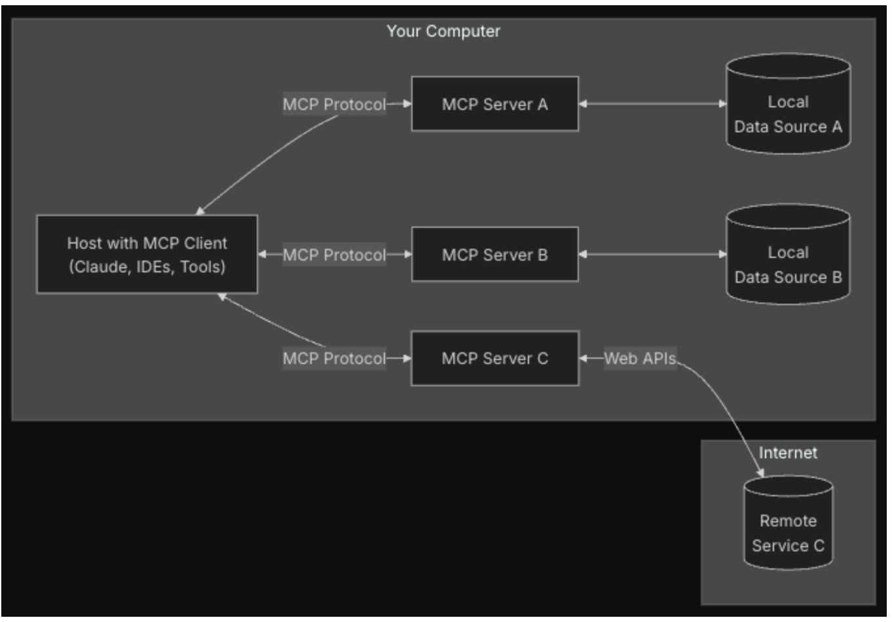
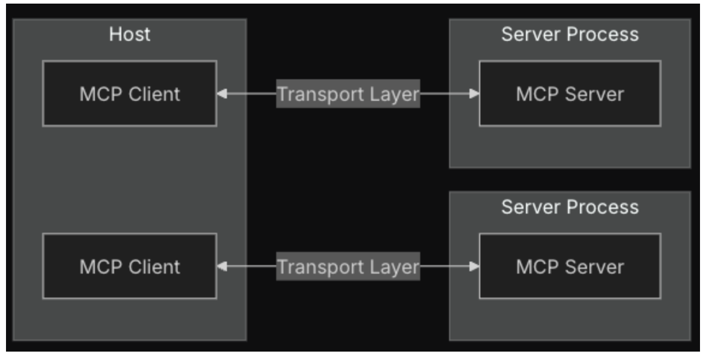
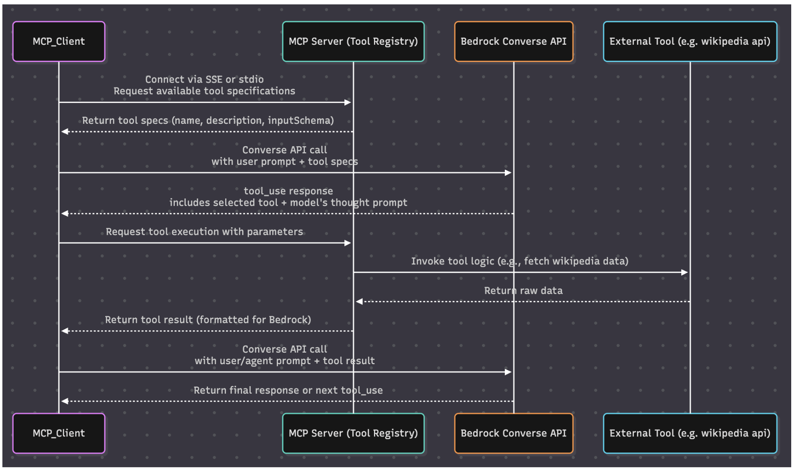

##🚀 Model Context Protocol (MCP)

### Overview
MCP (Model Context Protocol)는 애플리케이션이 LLM(Large Language Model)과 상호작용할 때 컨텍스트를 제공하는 방법을 표준화한 개방형 프로토콜입니다. USB-C와 같이 AI 애플리케이션을 위한 표준 연결 방식으로 이해할 수 있습니다.

### Why MCP?
MCP는 다음과 같은 이점을 제공하여 LLM 기반 에이전트와 복잡한 워크플로우 구축을 지원합니다:
- 미리 구축된 다양한 통합 기능 제공
- 여러 LLM 제공업체 간 쉬운 전환 가능
- 데이터 보안을 위한 모범 사례 제공

### 🏗️ Architecture
MCP는 클라이언트-서버 아키텍처를 기반으로 하며 다음과 같은 주요 구성요소로 이루어져 있습니다:

#### Components
1. **MCP Hosts**
   - Claude Desktop, IDE 등 MCP를 통해 데이터에 접근하는 프로그램
   - 주요 파일: `main_sse.py`, `main_stdio.py`, `mcp_client/converse_agent.py`, `converse_tool.py`
   - Bedrock은 converse api의 tool_use spec을 사용하여 mcp_tool 연결
   > Note: Bedrock agent를 비롯한 tool_use와 같은 기능을 지원하지 않는 LLM서비스는 MCP 사용이 제한될 수 있습니다.

2. **MCP Clients**
   - 서버와 1:1 연결을 유지하는 프로토콜 클라이언트
   - 주요 파일: `mcp_client/client.py`

3. **MCP Servers**
   - 표준화된 Model Context Protocol을 통해 특정 기능 제공
   - context, prompt, tool을 클라이언트에게 제공
   - 주요 파일: `mcp_server/server.py`

### 🧩 Core Architecture 

#### Transport Layer
JSON-RPC 기반으로 구현되며 다음과 같은 전송 방식을 지원합니다:
- **Stdio transport**: 표준 IO를 사용하며 로컬 프로세스에 적합
- **HTTP with SSE transport**: Server to Client 메시지를 위한 server-sent events 사용

#### Core Features
- **Prompt**: LLM과의 상호작용을 위한 프롬프트 관리
- **Tools**: LLM이 서버를 통해 작업을 수행할 수 있도록 지원
- **Resource**: 

### File Structure
```
.
├── main_sse.py
├── main_stdio.py
├── mcp_client/
│   ├── client.py
│   ├── converse_agent.py
│   └── converse_tool.py
└── mcp_server/
    └── server.py
```
### 🔄 mcp_client , server, bedrock sequence diagram

-------
### ✅ Prerequisites
- Python 3.13+
- PostgreSQL (via Docker)

#### Start PostgreSQL with Docker Compose

```bash
  docker-compose -f docker-compose/docker-compose.yml up -d
```

#### Initialize the Database

- SQL initialization script: /init/init.sql  
  (Includes both DDL and DML)

---

### ⚡ Quick Start

1. Set up a virtual environment (recommended):

```bash
  python -m venv venv
  source venv/bin/activate  # On Windows: venv\Scripts\activate
```

2. Install dependencies:

```bash
  pip install -r init/requirements.txt
```
3. Run (sse, stdio)
```bash
   
  python3 main_stdio.py
  
  // sse 연결시, 

  fastmcp run mcp_server/server.py -t sse
  python3 main_sse.py
```
 
 
---


### 🐘 PostgreSQL Driver Issue (psycopg)

만약, 아래 오류가 출력된다면 
```
ImportError: no pq wrapper available.
Attempts made:
- couldn't import psycopg 'c' implementation: No module named 'psycopg_c'
- couldn't import psycopg 'binary' implementation: No module named 'psycopg_binary'
- couldn't import psycopg 'python' implementation: libpq library not found
```

아래  PostgreSQL client libraries 설치하십시오. 또는 postgres 모듈을 변경 사용해도 됩니다.

#### macOS:

```bash
  brew install libpq
  brew link --force libpq
```

#### Ubuntu:

```bash
  sudo apt-get install libpq-dev
```
